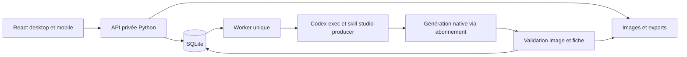

# Architecture et exploitation

## Composition

React + Vite pour l’interface. Python 3.11+ pour le serveur local et le worker ; Pillow valide les images. SQLite pour les projets, posts, travaux, feedbacks et sessions. Fichiers immuables pour les versions d’images. Aucun SDK image ni fournisseur payant.

## Exécution d’un travail

`create_pack` compose cinq slots et met le travail en file. Le worker revendique un travail via transaction SQLite, puis crée un répertoire isolé `runtime/jobs/<id>/` contenant le brief, la mémoire propre au projet et quelques références. Les retours récents du même projet sont inclus. Les instructions et sujets sont passés par fichiers/stdin, jamais interpolés dans une commande shell.

`codex exec --sandbox workspace-write -c approval_policy="never" --enable image_generation --disable multi_agent --json` exécute le travail avec l’authentification ChatGPT déjà enregistrée. Le modèle vient de la configuration Codex de l’utilisateur, sans substitution imposée. `OPENAI_API_KEY` et `CODEX_API_KEY` sont retirées de l’environnement du processus. `codex login status` doit indiquer ChatGPT. Le skill utilise exclusivement l’outil natif et s’arrête s’il est indisponible.

`post.json` doit contenir un titre ≤120 caractères, une description ≤1800 caractères et 1–5 hashtags valides. Chaque image doit être lisible par Pillow, avoir au moins 512 px sur son petit côté et respecter le ratio choisi (tolérance 0,04). Les sorties validées sont recopiées en PNG sous des noms uniques. L’app ne déclare pas un post prêt si sa fiche ou ses images manquent.

Une réussite du processus seule ne suffit pas. Une sortie dessinée factice n’est jamais utilisée comme fallback de production. Les providers synthétiques n’existent que dans `tests/`.

## Versions et reprises

Une correction conserve le fichier actif comme référence, crée une nouvelle image et ajoute une entrée d’historique. En cas d’échec, l’ancien post reste téléchargeable. Une reprise d’un travail incomplet ne redemande que les slots manquants. Si seule la fiche manque, la reprise ne demande aucune nouvelle image.

Les travaux `running` trouvés au redémarrage passent en échec explicite, sans auto-retry. En cas d’arrêt brutal du système, vérifier l’absence d’un ancien processus Codex encore actif avant de reprendre. Les sorties partielles encore seulement dans le répertoire du travail ne sont pas automatiquement réimportées après un crash ; elles sont conservées localement pour récupération.

Un verrou de lancement empêche deux serveurs principaux de posséder simultanément le même volume. Le MVP utilise un worker par machine, pas une file distribuée.

## Accès et stockage

Connexion par code privé généré dans `runtime/access-code`, mode fichier 0600. Après connexion : cookie HttpOnly, SameSite Strict et expiration de 30 jours. Requêtes de mutation avec contrôle d’origine. Limite de tentatives de login. Routes données, médias et exports protégées. Les images de référence historiques ne sont pas incluses dans le bundle public React.

Le serveur écoute par défaut sur 127.0.0.1. Pour le téléphone sur le réseau local, lancer avec `--host 0.0.0.0` et utiliser l’adresse LAN du Mac. Pour Internet/VPS, utiliser HTTPS et `STUDIO_SECURE_COOKIE=1`. Le partage natif et le presse-papiers dépendent du navigateur et du contexte sécurisé ; les téléchargements restent le fallback.

`runtime/` contient SQLite, images, code d’accès et journaux Codex : jamais poussé sur GitHub. Le dépôt privé contient seulement le code, les sources analytics explicitement demandées, les analyses et cinq références légères issues des archives. Ne pas mettre l’ensemble des PSD/MP4 dans Git.

## Configuration

| Variable | Valeur par défaut | Usage |
|---|---|---|
| `STUDIO_RUNTIME` | `./runtime` | Volume persistant |
| `STUDIO_CODEX_BIN` | `codex` | Exécutable Codex |
| `STUDIO_DAILY_IMAGES` | `40` | Nombre de slots demandés sur 24 h, reprises comprises |
| `STUDIO_JOB_TIMEOUT` | `1500` | Délai maximal par travail, secondes |
| `STUDIO_SECURE_COOKIE` | absent | `1` derrière HTTPS |
| `CODEX_HOME` | géré par Codex | Configuration, skills et authentification de l’utilisateur |

La limite locale est un plafond de demandes, pas un compteur de quotas OpenAI ni une estimation tarifaire. Ne pas configurer de clé d’API image. Les quotas d’abonnement restent ceux du compte.

## Mac vers VPS

Le même serveur sert le bundle React et l’API. Construire avec Node 22.12+ (`npm ci && npm run build`), installer Python/Pillow, puis exécuter `python3 server.py`. Sauvegarder le volume SQLite avec son API de backup ou serveur arrêté, et copier les médias associés. Garder les jobs et fichiers ensemble pour préserver l’historique.

Sur le VPS, utiliser un utilisateur système dédié avec son propre `codex login`. Installer le skill `imagegen` compatible dans cet environnement si absent. Ne pas committer/copier des tokens d’authentification dans le dépôt. Vérifier la disponibilité de l’outil natif par une image test sur ce VPS avant de basculer. Le succès local ne garantit pas l’accès sur tout hôte ou compte.

Mettre le serveur derrière un proxy HTTPS ou un réseau privé, stocker `runtime` sur un volume persistant et superviser le processus. Le MVP ne configure pas automatiquement un VPS ni un domaine ; aucune infrastructure distante n’est créée.

## Documentation vérifiée

- [Codex non interactif](https://learn.chatgpt.com/docs/non-interactive-mode) : `exec`, JSONL, permissions et authentification enregistrée. Aide locale vérifiée avec Codex CLI 0.154.0.
- [Skills Codex](https://learn.chatgpt.com/docs/build-skills) : instructions de travail réutilisables. Le skill imagegen local distingue l’outil natif du fallback API ; ce dernier est exclu ici.
- [React](https://react.dev/reference/react/useEffect) : cycle de vie et nettoyage des effets.
- [Vite](https://vite.dev/config/server-options.html#server-proxy) : proxy de développement ; build statique pour le serveur.
- [Pillow](https://pillow.readthedocs.io/en/stable/reference/Image.html) : validation et décodage des fichiers.
- [GitHub CLI](https://cli.github.com/manual/gh_repo_create) : création du dépôt privé depuis les sources locales.

Les sources documentaires établissent les interfaces ; le test réel décrit dans `VALIDATION.md` établit la disponibilité du moteur image sur ce Mac.

## Adaptateur agent et direction photographique

`cli.py` et l’API utilisent le même `Store`. Les demandes agent n’embarquent pas de worker : le serveur reste propriétaire unique de la consommation de la file. `create_pack` accepte désormais `count` de 1 à 5 et une liste de sujets facultative, sans modifier la sélection du projet pour les demandes suivantes. L’UI conserve cinq images par défaut. Contrat complet : [AGENT-CLI.md](AGENT-CLI.md).

Le producteur écrit un `shot-plan.json` avant génération et un `shot-review.json` après inspection. Ces fichiers internes ne sont pas une preuve automatique de qualité ; le worker valide les fichiers image et la fiche, le jugement visuel reste qualitatif. Les images actives du même pack sont transmises dans `continuity_images`, même pour les slots non demandés, afin d’aider les reprises et corrections sans réécrire les autres images. Les instructions distinguent identité et pose des références ; la DA Realify privilégie des moments vécus et une lumière liée au lieu. Les autres projets gardent leur esthétique.

## Organisation actuelle

- `domain.py` : concepts, chemins et validation des valeurs. Aucun effet de bord de base ou de processus.
- `studio.py` : dépôt SQLite et opérations sur les posts. Connexion transactionnelle locale au thread ; les appels imbriqués partagent la même transaction.
- `stories.py` : service de commandes utilisé par CLI et HTTP, reçus d’idempotence et épisodes. Les tables `stories` et `requests` sont ajoutées sans migration destructive des posts existants.
- `worker.py` : création du brief, cycle de vie Codex et validation/import des fichiers immuables. `finalize` permet de récupérer des fichiers natifs terminés après interruption sans les régénérer ; les slots déjà importés sont ignorés.
- `server.py` / `cli.py` : adaptateurs, aucune seconde implémentation des règles des séries.
- `web/App.jsx` : navigation et état partagé ; `components/` : lecteur, bibliothèque, éditeur, fiche, formulaires et primitives ; `views/` : séries, direction, analytics ; `lib.js` : transport et utilitaires.

Le contrôle des épisodes est transactionnel : on ne crée pas deux suites lorsque deux appels rejouent la même demande. Le marquage local de publication d’un épisode suit sa série si l’auto-next est activé et qu’aucun autre brouillon n’attend ; la fin de la série n’engendre pas une série infinie.

Les seuils hebdomadaires demandés pendant un travail Codex sont surveillés par relevés ; ils ne constituent pas un arrêt automatique du worker à un pourcentage exact. La limite locale de slots est distincte. Aucun crédit de reset ou fournisseur payant n’est utilisé.

Le serveur local est actuellement lancé en processus détaché, accessible sur 8787 tant que le Mac reste éveillé. Le démarrage automatique à l’ouverture de session n’est pas installé : l’essai LaunchAgent a été retiré après absence d’écoute réseau. `scripts/start.sh` reste le point de lancement documenté. Ne pas lancer un deuxième serveur sur le même runtime.

Pendant un job, `received_slots` rapporte les fichiers présents dans son dossier de sortie, sans les déclarer valides. `completed_slots` ne contient que les images importées après contrôle. Le navigateur conserve les versions actives précédentes pendant les corrections. Les compteurs ne sont pas un pourcentage de temps restant.

Les références d’archives Realify sont sélectionnées selon le casting. Si les références du projet ou du précédent épisode suffisent, les personnages d’archives sans rapport sont omis. Cela réduit le contexte superflu et la confusion d’identité ; aucune référence ajoutée explicitement au projet n’est supprimée.
